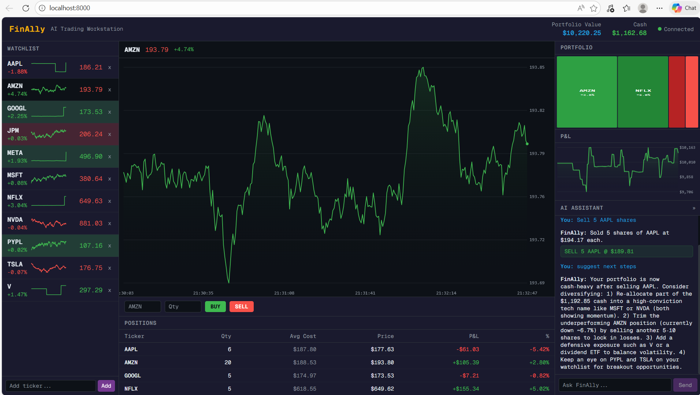

# FinAlly — AI Trading Workstation

A Bloomberg-inspired, AI-powered trading workstation with live-streaming market data, a simulated $10,000 portfolio, and an LLM assistant that can analyze your positions and execute trades via natural language.

Built entirely by orchestrated AI coding agents as a capstone for an agentic AI development.

---

## What It Looks Like

- **Dark terminal aesthetic** — data-dense layout inspired by Bloomberg
- **Live price feed** — prices flash green/red on every tick with sparkline mini-charts
- **10 default tickers** — AAPL, GOOGL, MSFT, AMZN, TSLA, NVDA, META, JPM, V, NFLX
- **Portfolio heatmap** — treemap sized by position weight, colored by P&L
- **AI chat** — ask "buy 10 shares of NVDA" and it just does it


---

## Quick Start

### Prerequisites
- Docker Desktop installed and running
- An [OpenRouter](https://openrouter.ai) API key (for the AI chat)

### Run

```bash
# 1. Clone and configure
git clone <repo-url>
cd finally
cp .env.example .env
# Edit .env and add your OPENROUTER_API_KEY

# 2. Start
# Mac / Linux:
./scripts/start_mac.sh

# Windows (PowerShell):
.\scripts\start_windows.ps1

# Or manually:
docker build -t finally .
docker run -d --name finally -p 8000:8000 -v finally-data:/app/db --env-file .env finally
```

Open **[http://localhost:8000](http://localhost:8000)** in Chrome, Edge, or Firefox.

### Stop

```bash
./scripts/stop_mac.sh       # Mac/Linux
.\scripts\stop_windows.ps1  # Windows
```

Your portfolio data persists in the `finally-data` Docker volume across restarts.

---

## Environment Variables

Copy `.env.example` to `.env` and fill in:

```bash
# Required — get a free key at https://openrouter.ai
OPENROUTER_API_KEY=your-key-here

# Optional — leave empty to use the built-in market simulator (recommended)
MASSIVE_API_KEY=

# Optional — set true to disable real LLM calls (for testing)
LLM_MOCK=false
```

---

## Features

### Live Market Data
Prices stream via Server-Sent Events (SSE) every 500ms. By default the built-in simulator uses Geometric Brownian Motion with sector correlations and occasional random events. Set `MASSIVE_API_KEY` to switch to real Polygon.io data.

### Simulated Portfolio
- Start with **$10,000 virtual cash**
- **Buy and sell** any watched ticker — market orders, instant fill
- **Positions table** shows quantity, average cost, current price, unrealized P&L
- **Portfolio heatmap** — treemap of positions sized by weight, green/red by P&L
- **P&L chart** — portfolio value over time, snapshotted every 30 seconds
- **Reset** via the AI chat: "reset my portfolio"

### Watchlist
- 10 default tickers pre-loaded
- Add any ticker symbol — starts simulating immediately
- Remove tickers from the watchlist
- Sparkline mini-charts accumulate from SSE data since page load

### AI Assistant
Powered by `openai/gpt-oss-120b` via OpenRouter (Cerebras inference). The assistant:
- Has full context of your current portfolio, positions, and watchlist
- Executes trades on your behalf: *"Buy 5 shares of MSFT"*
- Manages the watchlist: *"Add Tesla and remove Netflix"*
- Analyzes your portfolio: *"Am I too concentrated in tech?"*

---

## Architecture

Single Docker container on port 8000:

```
Browser
  │
  ├── GET /              → Next.js static export (HTML/JS/CSS)
  ├── GET /api/stream/prices  → SSE (live price feed)
  ├── GET|POST /api/watchlist → Watchlist CRUD
  ├── GET|POST /api/portfolio → Portfolio + trades
  └── POST /api/chat          → LLM chat
        │
        └── FastAPI (Python)
              ├── SQLite database (db/finally.db, volume-mounted)
              ├── In-memory PriceCache (fed by market simulator)
              └── LiteLLM → OpenRouter (Cerebras) → gpt-oss-120b
```

See `planning/ARCHITECTURE.md` for a full deep-dive.

---

## Development

### Backend (API only)
```bash
cd backend
uv sync --extra dev
DB_PATH=../db/finally.db uv run uvicorn app.main:app --reload --port 8000
```

### Frontend (UI only)
```bash
cd frontend
npm install
npm run dev    # http://localhost:3000
```

### Tests

```bash
# Backend — 125 unit tests
cd backend && uv run pytest -v

# E2E — 7 Playwright scenarios (requires Docker)
cd test
npm install
docker compose -f docker-compose.test.yml up --build --abort-on-container-exit
```

---

## Browser Support

Requires a **modern browser** with `EventSource` (SSE) support:
- Chrome / Chromium
- Microsoft Edge (Chromium-based)
- Firefox

**Internet Explorer is not supported.**

---

## Project Structure

```
finally/
├── frontend/          # Next.js TypeScript (static export)
├── backend/           # FastAPI Python (uv)
│   ├── app/market/    # Price simulator + Polygon.io client
│   ├── app/routes/    # API route handlers
│   ├── app/database.py
│   ├── app/chat.py
│   └── tests/
├── planning/          # Architecture and specification docs
├── test/              # E2E Playwright tests
├── scripts/           # Start/stop helpers (Mac + Windows)
├── db/                # SQLite volume mount (runtime only)
├── Dockerfile
├── docker-compose.yml
└── .env.example
```
